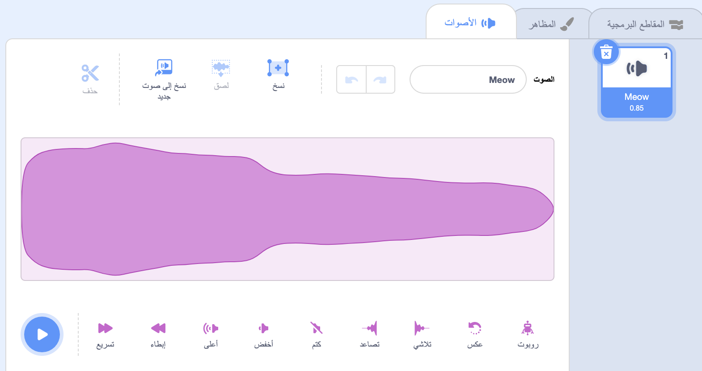
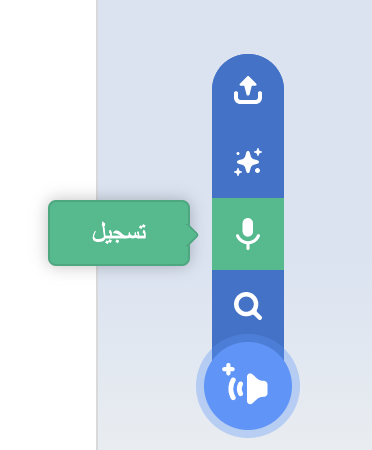
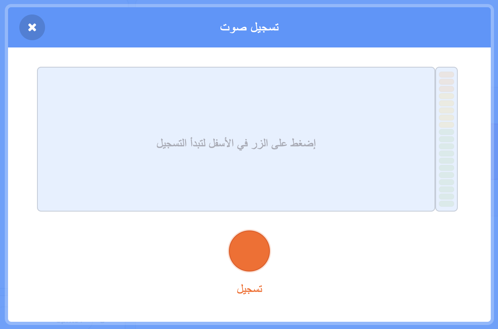
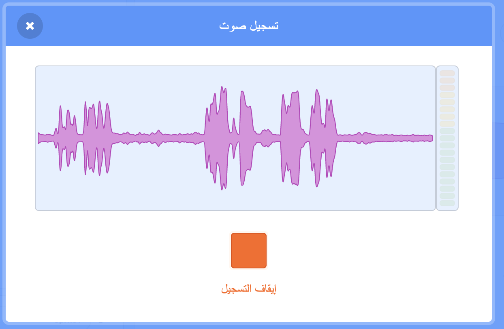
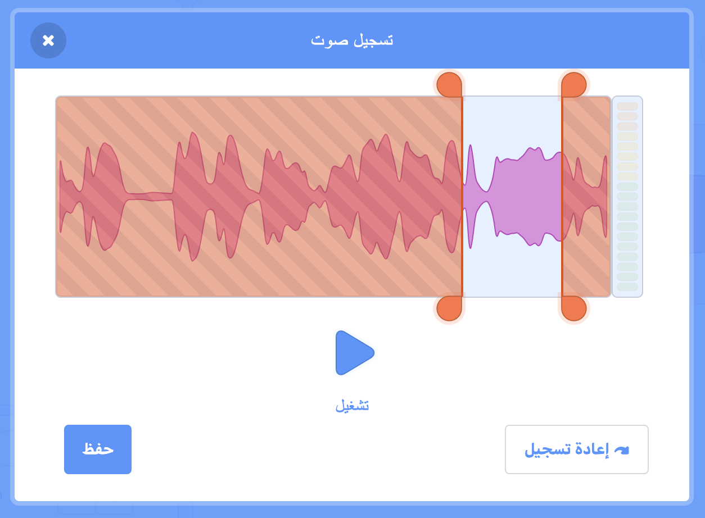
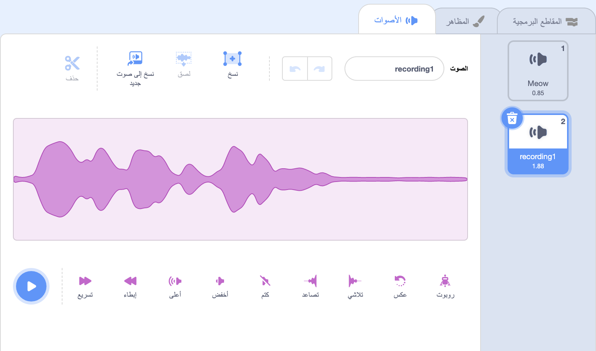
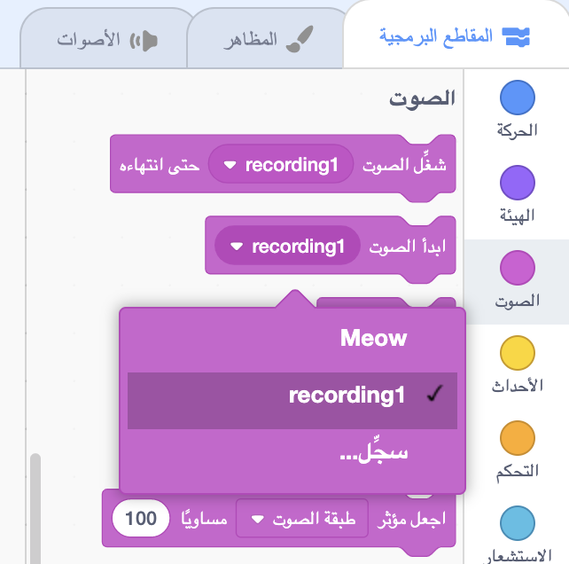

حدد الكائن الذي تريده أن يحصل على الصوت الجديد، ثم حدد علامة التبويب **الأصوات**:

اذهب إلى **اختيار صوت** وحدد خيار **تسجيل**:

عندما تكون جاهزًا ، انقر فوق **تسجيل** لبدء تسجيل صوتك:

انقر فوق **إيقاف التسجيل** لإيقاف تسجيل الصوت:

سيظهر التسجيل الجديد الخاص بك. يمكنك **إعادة تسجيل** صوتك إذا لم تكن راضيًا عنه.

اسحب الدوائر البرتقالية لاقتصاص صوتك ؛ سيكون جزء الصوت ذو الخلفية الزرقاء (بين الدوائر البرتقالية) هو الجزء الذي يتم الاحتفاظ به:

عندما تكون سعيدًا بالتسجيل الخاص بك ، انقر فوق الزر **حفظ**. ستتم إعادتك مباشرة إلى علامة التبويب **الأصوات** وستتمكن من رؤية الصوت الذي أضفته للتو:

إذا قمت بالتبديل إلى **التعليمة البرمجية** التبويب ونظرة على `صوت`{: class= "block3sound"} القائمة التعليمات البرمجية، سوف تكون قادرا على تحديد الصوت الجديد:

