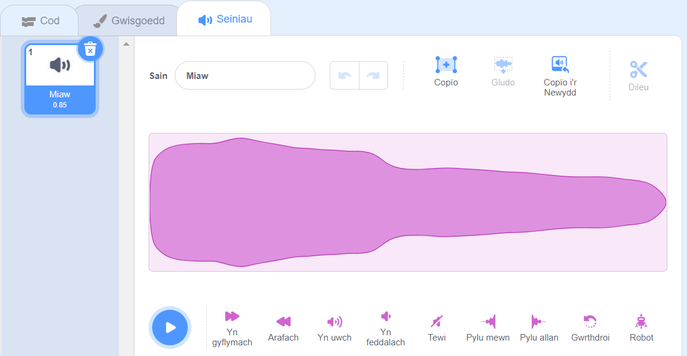
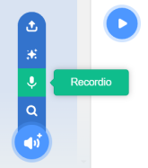
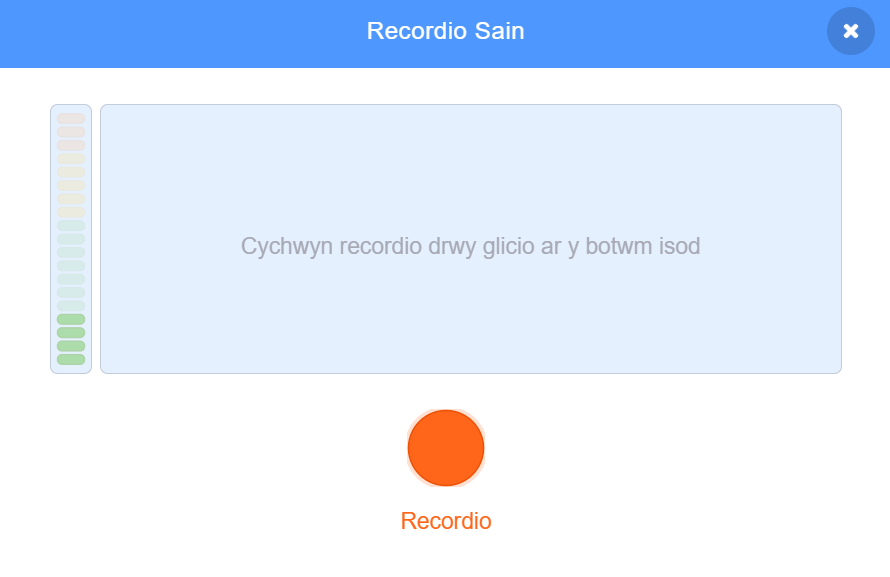
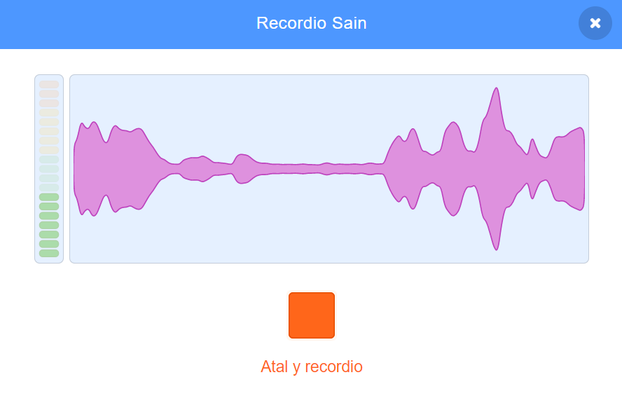
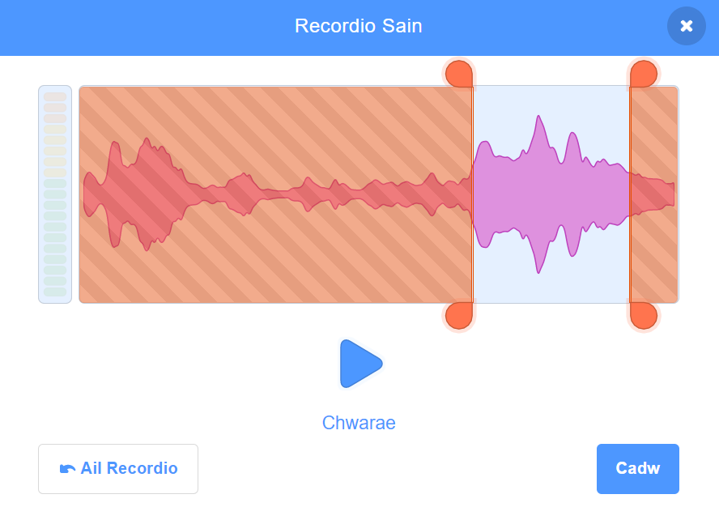
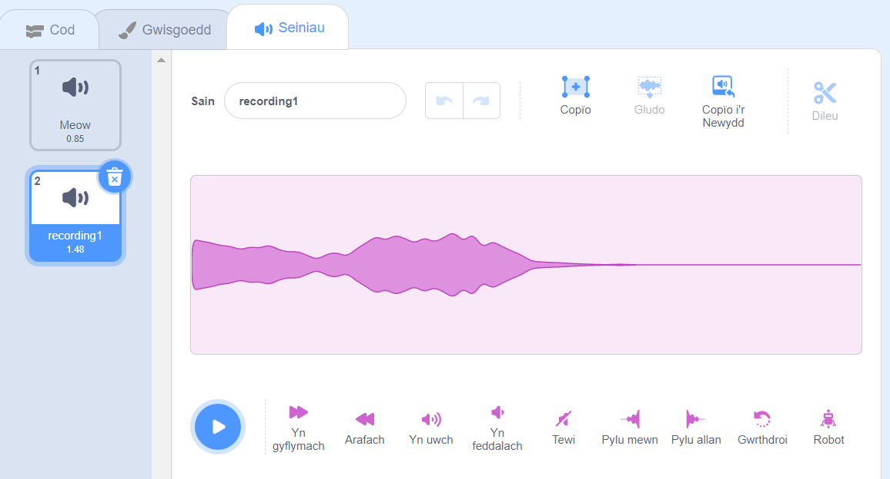
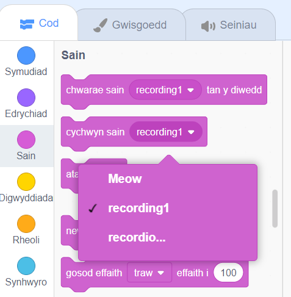

Dewisa'r corlun rwyt ti am roi'r sain newydd wedi'i recordio iddo, wedyn dewis y tab **Seiniau**:

Cer i'r ddewislen **Dewiswch Sain** a dewis yr opsiwn **Recordio**:

Pan fyddi di'n barod, clicia ar y botwm **Recordio** i ddechrau recordio dy sain:

Clicia'r botwm **Stopio recordio** i roi'r gorau i recordio dy sain:

Bydd dy recordiad newydd yn cael ei ddangos. Galli di **Ail-recordio** dy sain os nad wyt ti'n hapus â hi.

Llusga'r cylchoedd oren i docio dy sain; y rhan o'r sain gyda chefndir glas (rhwng y cylchoedd oren) fydd y rhan sy'n cael ei chadw:

Pan fyddi di'n hapus â dy recordiad, clicia'r botwm **Cadw**. Byddi di'n cael dy dywys yn syth yn ôl i'r tab **Seiniau** a byddi di'n gallu gweld y sain rwyt ti newydd ei ychwanegu:

Os byddi di'n newid i'r tab **Cod** ac yn edrych ar y ddewislen blociau `Sain`{:class="block3sound"}, byddi di'n gallu dewis y sain newydd:

