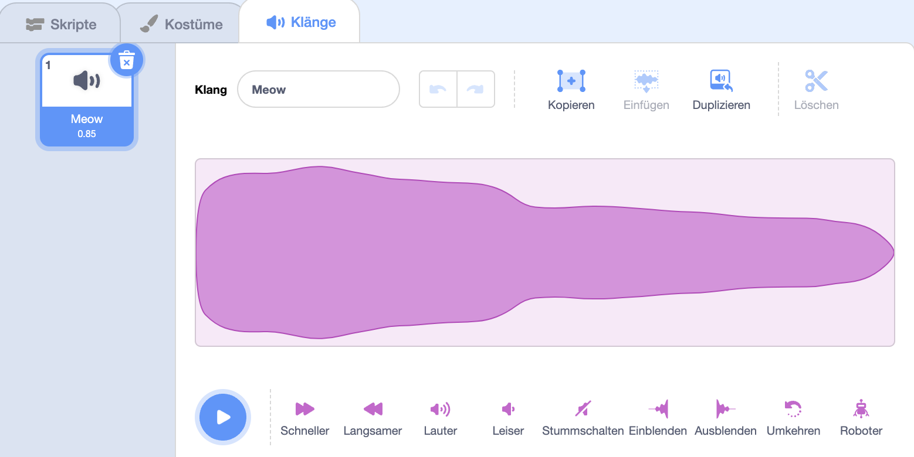
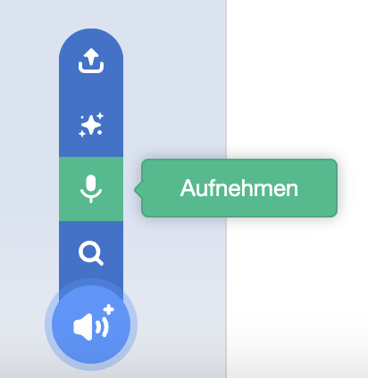
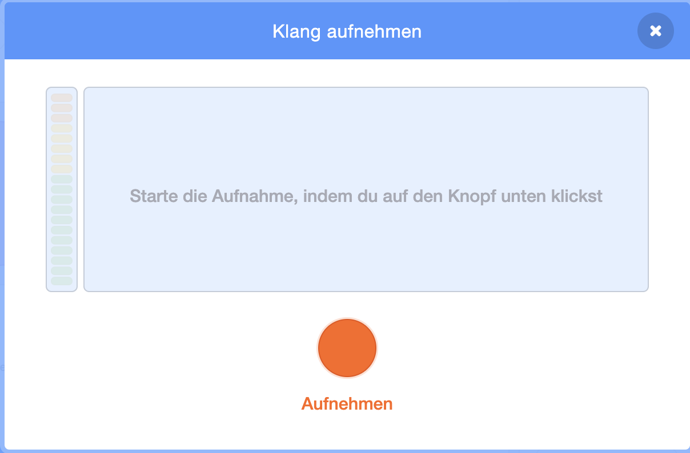
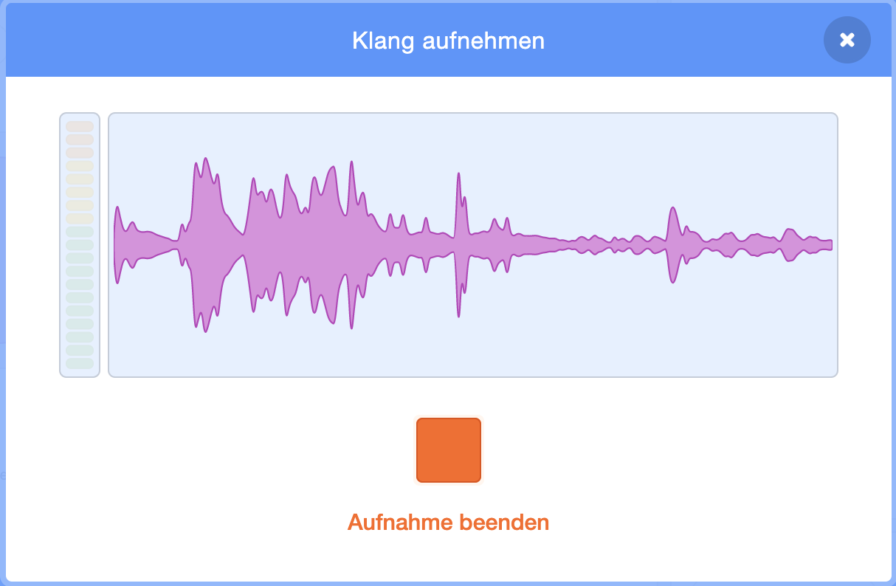
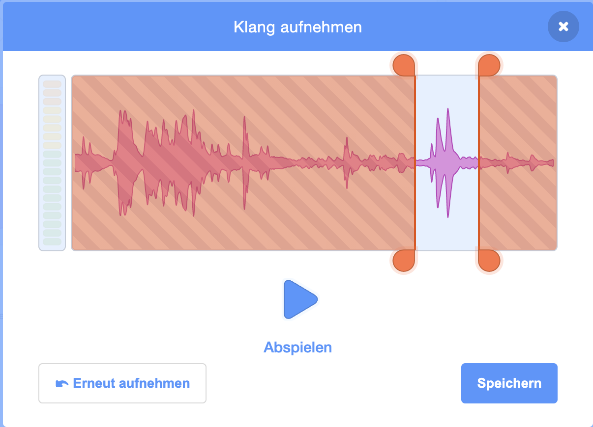
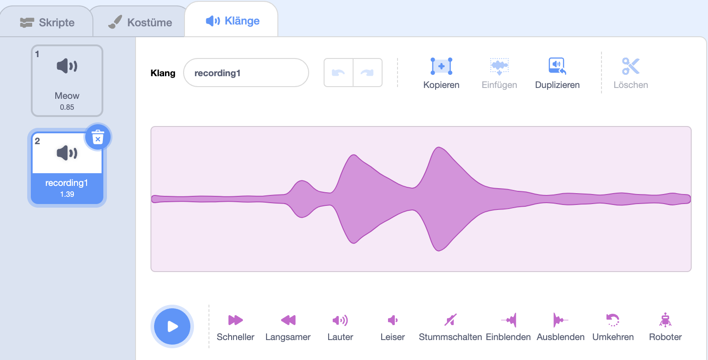
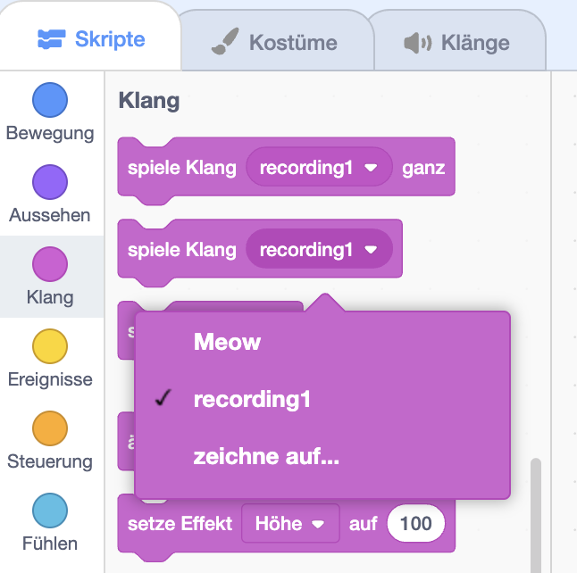

Wähle die Figur aus, die den neu aufgenommenen Ton haben soll, und wähle dann die Registerkarte „ **Klänge** “:

Gehe zum Menü „ **Klang wählen** “ und wähle die Option „ **Aufnehmen** “:

Wenn du bereit bist, klicke auf die Schaltfläche **Aufnehmen**, um mit der Tonaufnahme zu beginnen:

Klicke auf die **Aufnahme beenden** Taste, um die Aufnahme deines Klangs zu beenden:

Deine neue Aufnahme wird angezeigt. Du kannst deinen Sound **Erneut aufnehmen**, wenn du nicht damit zufrieden bist.

Ziehe die orangefarbenen Kreise, um den Klang zuzuschneiden. Der Teil des Tons mit blauem Hintergrund (zwischen den orangefarbenen Kreisen) bleibt erhalten:

Wenn du mit deiner Aufnahme zufrieden bist, klicke auf die Schaltfläche **Speichern**. Du wirst direkt zur Registerkarte „**Klänge**“ zurückgeleitet und kannst den Klangsehen, den du gerade hinzugefügt hast:

Wenn du zur Registerkarte **Skripte** wechselst und dir das Blockmenü `Klang`{:class="block3sound"} ansiehst, kannst du den neuen Klang auswählen:

