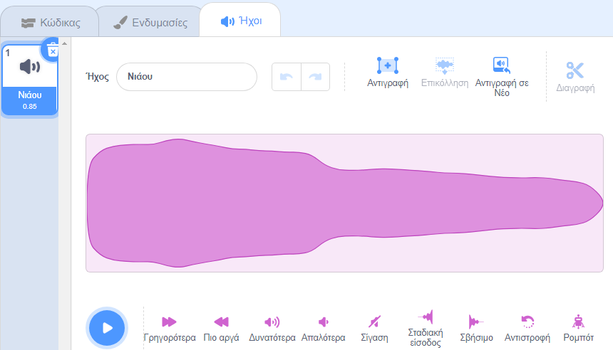
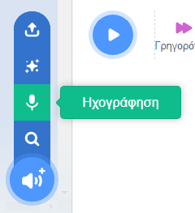
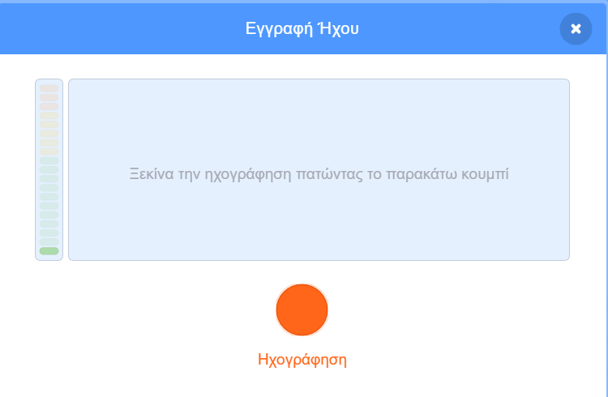
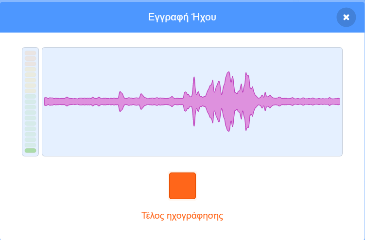
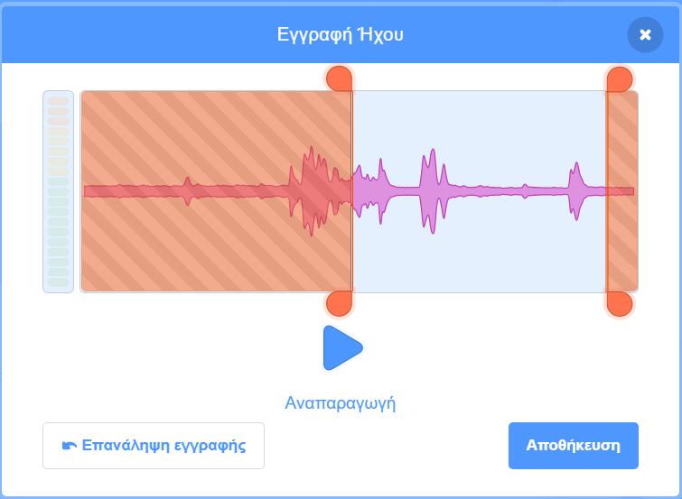
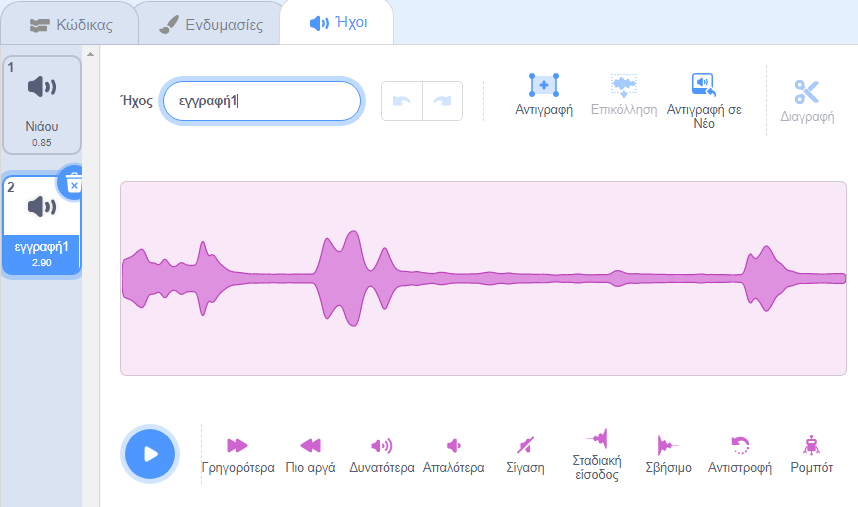
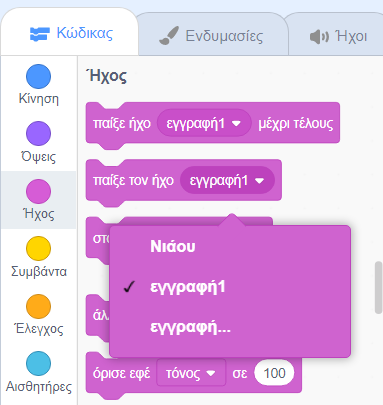

Επίλεξε τον χαρακτήρα που θέλεις να έχεις τον νέο ηχογραφημένο ήχο και, στη συνέχεια, επίλεξε την καρτέλα **Ήχοι**:

Πήγαινε στο μενού **Διάλεξε ήχο** και επίλεξε **Ηχογράφηση**:

Όταν είσαι έτοιμος, κάνε κλικ στο κουμπί **Εγγραφή** για να ξεκινήσεις την εγγραφή του ήχου σου:

Κάνε κλικ στο κουμπί **Διακοπή** για να σταματήσεις την εγγραφή της φωνής σου:

Θα εμφανιστεί η νέα σου εγγραφή. Μπορείς να **ξαναηχογραφήσεις** τη φωνή σου, αν δεν είσαι ευχαριστημένος.

Σύρε τους πορτοκαλί κύκλους για περικοπή του ήχου σου. Το μέρος του ήχου με μπλε φόντο (μεταξύ των πορτοκαλί κύκλων) θα είναι το μέρος που διατηρείται:

Όταν είσαι ικανοποιημένος με την εγγραφή σου, κάνε κλικ στο κουμπί **Αποθήκευση**. Θα μεταφερθείς κατευθείαν στην καρτέλα **Ήχοι** και θα μπορείς να δεις τον ήχο που μόλις πρόσθεσες:

Εάν μεταβείς στην καρτέλα **Κώδικας** και κοιτάξεις το μενού μπλοκ `Ήχος`{:class="block3sound"}, θα μπορείς να επιλέξεις τον νέο ήχο:

