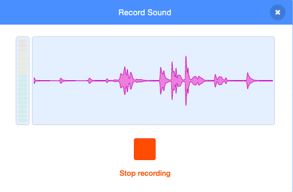
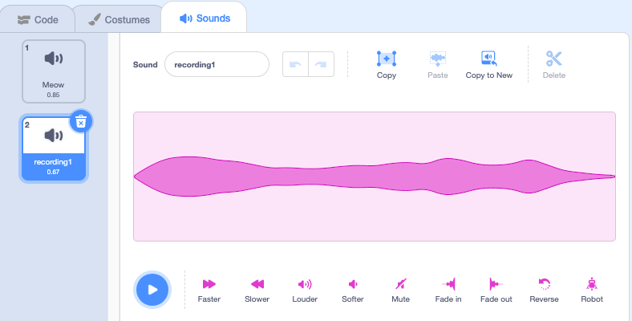
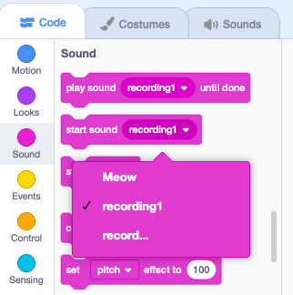

## Record sound

Select the sprite that you want to have the new recorded sound, then select the **Sounds** tab.

Go to the **Choose a Sound** menu and select the **Record** option.

When you are ready, click the **Record** button to start recording your sound.

Click the **Stop recording** button to stop recording your sound.

Your new recording will be shown. You can **Re-record** your sound if you are not happy with it. 

Drag the orange circles to crop your sound; the part of the sound with a blue background (between the orange circles) will be the part that is kept.

When you are happy with your recording, click the **Save** button. You will be taken straight back to the **Sounds** tab and you will be able to see the sound that you just added.

If you switch to the **Code** tab and look at the `Sound`{:class="block3sound"} blocks menu, you will be able to select the new sound.

