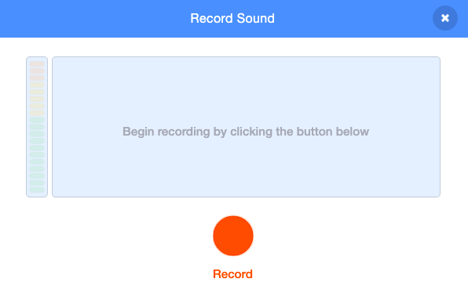

## Record sound

Select the sprite that you want to have the new recorded sound and select the **Sounds** tab. Each sprite starts with a default sound.

Click the **Record a Sound** button.

When you are ready, click on the **Record** button to start recording your sound.

Click on the **Stop recording** button to stop recording your sound.

Your new recording will be shown. You can **Re-record** your sound if you are not happy with it. 

Drag the orange circles to crop your sound, the part of the sound with a blue background in the middle will be the part that is kept. You can press the **Play** button to hear your sound then keep moving the circles until you get the section you want.  

When you are happy with your recording click on the **Save** button. You will be taken straight back to the **Sounds** tab and you will be able to see the sound that you just added.

If you switch to the **Code** tab and look at the Sound Blocks menu, you will be able to select the new sound.

