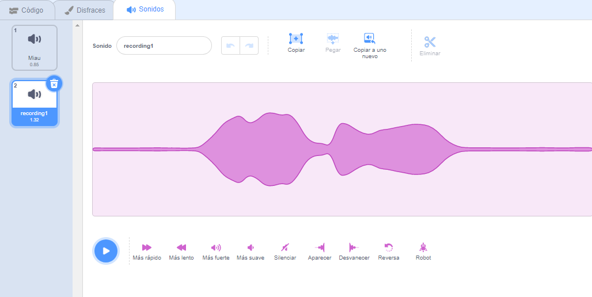

Selecciona el objeto que deseas que tenga el nuevo sonido grabado, luego selecciona la pestaña **Sonidos**:

Ve al menú **Elige un sonido** y selecciona la opción **Grabar**:

Cuando estés listo, haz clic en el botón **Grabar** para comenzar a grabar tu sonido:

Haz clic en el botón **Parar de grabar** para terminar de grabar tu sonido:

Se mostrará tu nueva grabación. Puedes **Volver a grabar** tu sonido si no estás satisfecho con él.

Arrastra los círculos naranjas para recortar tu sonido; la parte del sonido con fondo azul (entre los círculos naranjas) será la parte que se mantenga:

Cuando estés satisfecho con tu grabación, haz clic en el botón **Guardar**. Volverás directamente a la pestaña **Sonidos** y podrás ver el sonido que acabas de agregar:

Si cambias a la pestaña **Código** y miras el menú de bloques `Sonido`{:class="block3sound"}, podrás seleccionar el nuevo sonido:

