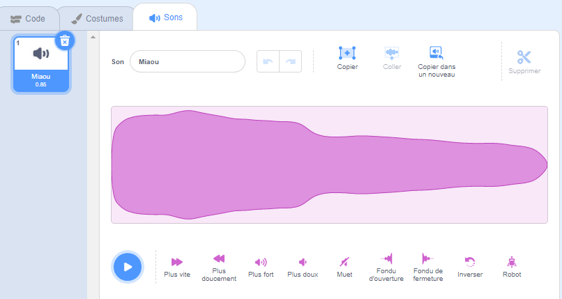
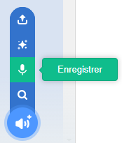
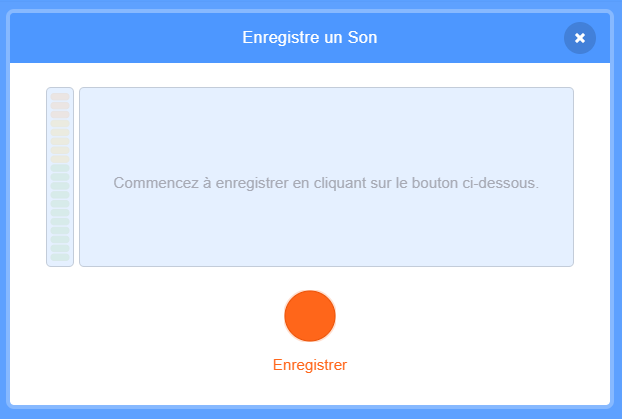
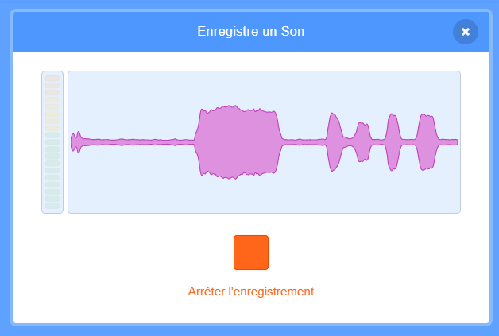
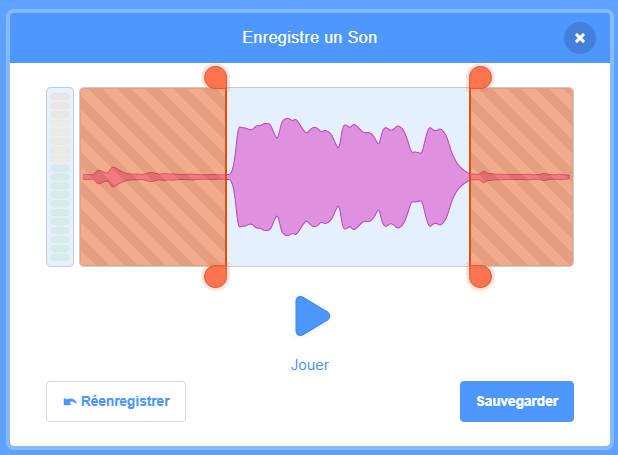
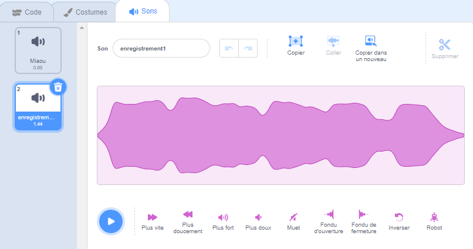
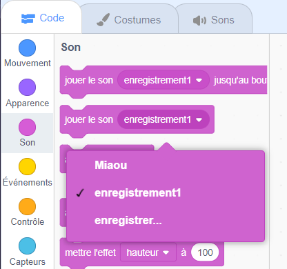

Sélectionne le sprite dont tu souhaites enregistrer le nouveau son, puis sélectionne l'onglet **Sons** :

Va dans le menu **Choisir un son** et sélectionne l'option **Enregistrer** :

Lorsque tu es prêt, clique sur le bouton **Enregistrer** pour commencer à enregistrer ton son :

Clique sur le bouton **Arrêter l'enregistrement** pour arrêter l'enregistrement de ton son :

Ton nouvel enregistrement sera affiché. Tu peux **réenregistrer** ton son si tu n'es pas satisfait.

Fais glisser les cercles orange pour découper ton son ; la partie du son avec un arrière-plan bleu (entre les cercles orange) sera la partie conservée :

Lorsque tu es satisfait de ton enregistrement, clique sur le bouton **Enregistrer**. Tu seras redirigé directement vers l'onglet **Sons** et tu pourras voir le son que tu viens d'ajouter.

Si tu passes à l'onglet **Code** et regardes les blocs `Son`{:class="block3sound"}, tu pourras sélectionner le nouveau son :

