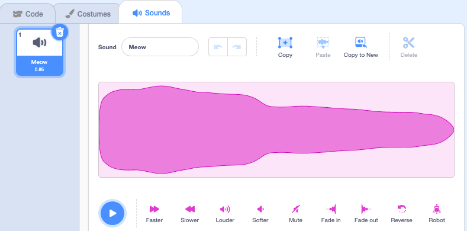

उस स्प्राइट का चयन करें जिसे आप नई रिकॉर्ड की गई ध्वनि चाहते हैं, फिर **ध्वनि** टैब चुनें:

**ध्वनि** मेनू चुनें और **अभिलेखबद्ध** विकल्प चुनें:

जब आप तैयार हों, तो **अभिलेखबद्ध** बटन पर क्लिक करें अपनी ध्वनि अभिलेखबद्ध करना शुरू करे:

अपनी ध्वनि अभिलेखबद्ध करना बंद करने के लिए **ध्वनि अभिलेखबद्ध बंद करें** बटन पर क्लिक करें:

आपकी नई अभिलेखबद्ध दिखाई देगी। यदि आप अपनी ध्वनि से खुश नहीं हैं तो आप **पुनः अभिलेखबद्ध** कर सकते हैं।

अपनी ध्वनि काटने के लिए नारंगी वृत्त को खींचें; नीली पृष्ठभूमि वाली ध्वनि का भाग (नारंगी वृत्तों के बीच) वह भाग होगा जिसे रखा गया है:

जब आप अपनी रिकॉर्डिंग से खुश हों, तो **सेव** बटन पर क्लिक करें। आपको सीधे **ध्वनि** टैब पर ले जाया जाएगा और आप उस ध्वनि को देख पाएंगे जिसे आपने अभी जोड़ा है:

यदि आप **कोड** टैब पर स्विच करते हैं और `ध्वनि`{:class="block3sound"} ब्लॉक मेनू को देखते हैं, तो आप नई ध्वनि का चयन करने में सक्षम होंगे:

