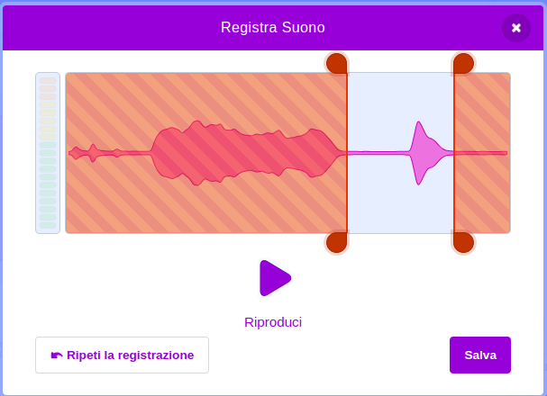

Seleziona lo sprite a cui vuoi aggiungere il nuovo suono registrato, poi seleziona la scheda **Suoni**:

Vai al menu **Scegli un Suono** e seleziona l'opzione **Registra**:

Quando sei pronto, fai clic sul pulsante **Registra** per iniziare a registrare il tuo suono:

Fai clic sul pulsante **Arresta la registrazione** per fermare la registrazione:

Il tuo nuovo suono verrà mostrato. Puoi **registrare nuovamente** il tuo suono se non sei soddisfatto.

Trascina i cerchi arancioni per ritagliare il suono; la parte del suono con sfondo blu (tra i cerchi arancioni) sarà quella che verrà utilizzato:

Quando sei soddisfatto della registrazione, fai clic sul pulsante **Salva**. Verrai riportato direttamente alla scheda **Suoni** e potrai vedere il suono che hai appena aggiunto:

Se passi alla scheda **Codice** e selezioni il menu dei blocchi `Suono`{:class="block3sound"}, potrai selezionare il nuovo suono:

