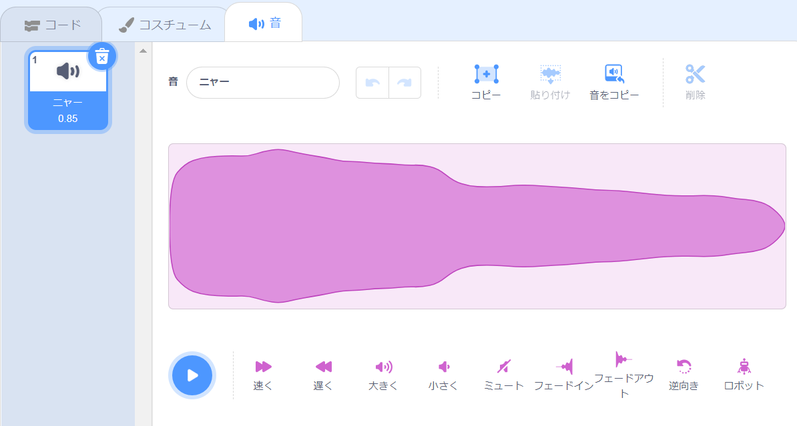
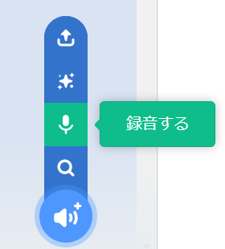
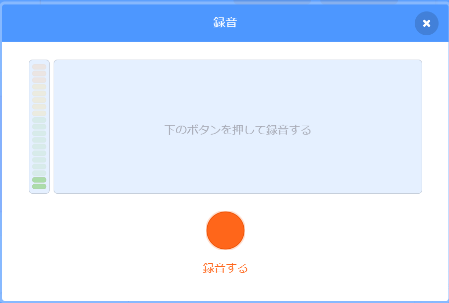
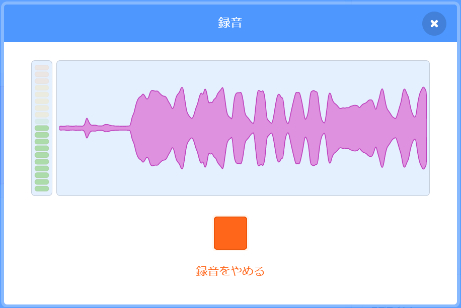
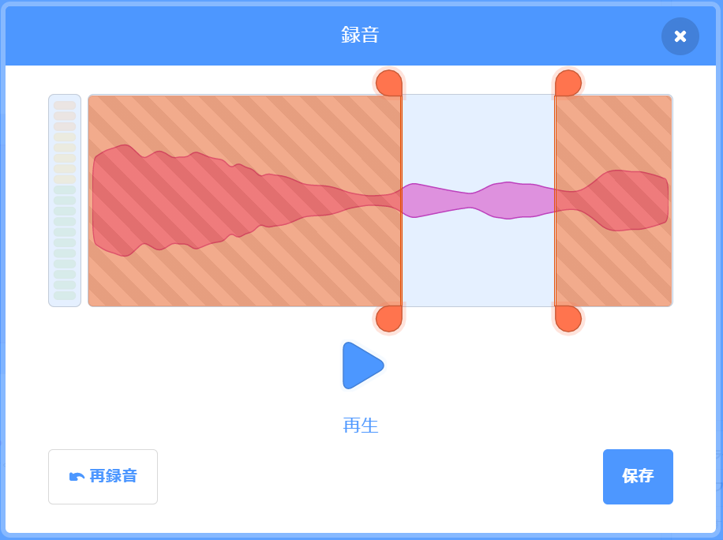
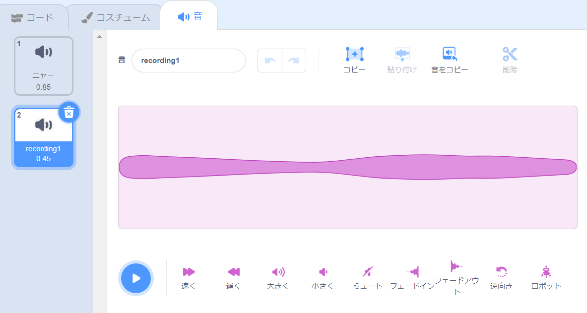
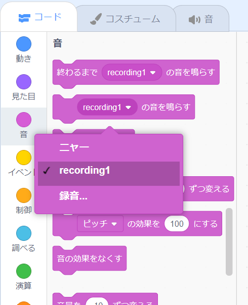

新しく録音するサウンドにするスプライトを選択してから、**音**タブを選択します。

**音を選ぶ** メニューに移動し、**録音する**オプションを選択します。

準備ができたら、**録音する**ボタンをクリックして、音の録音を開始します。

**録音をやめる** ボタンをクリックして、音の録音を停止します。

新しい録音が表示されます。 満足できない場合は、音を **再録音**することが出来ます。

オレンジ色の円をドラッグしてサウンドをトリミングします。背景が青色のサウンドの部分（オレンジ色の円の間）が保持される部分になります。

録音に満足したら、**保存** ボタンをクリックします。 **音** タブに戻り、追加したばかりのサウンドを確認できます。

**コード** タブに切り替えて、 `音`{：class = "block3sound"}ブロックメニューを見ると、新しいサウンドを選択できます。

