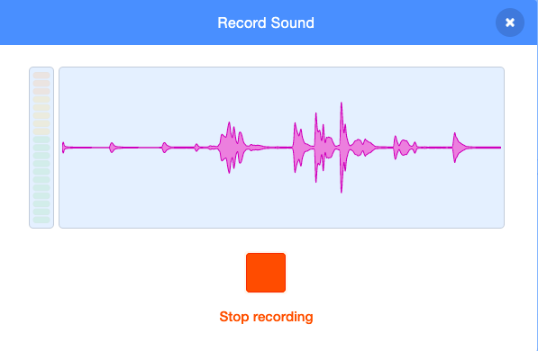
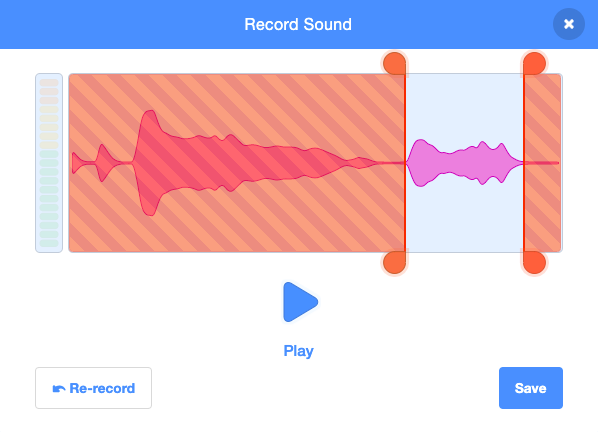

ನೀವು ರೆಕಾರ್ಡ್ ಮಾಡಿದ ಹೊಸ ಧ್ವನಿಯನ್ನು ಹೊಂದಲು ಬಯಸುವ ಸ್ಪ್ರೈಟ್ ಅನ್ನು ಆಯ್ಕೆ ಮಾಡಿ, ನಂತರ **Sounds** ಟ್ಯಾಬ್ ಅನ್ನು ಆಯ್ಕೆ ಮಾಡಿ:

**Choose a Sound** ಮೆನುವನ್ನು ಆಯ್ಕೆ ಮಾಡಿ ಮತ್ತು **Round** ಆಯ್ಕೆಯನ್ನು ಆರಿಸಿ:

ನೀವು ರೆಕಾರ್ಡ್ ಮಾಡಲು ಸಿದ್ಧರಾದಾಗ, ನಿಮ್ಮ ಧ್ವನಿಯನ್ನು ರೆಕಾರ್ಡ್ ಮಾಡಲು **Record** ಆಯ್ಕೆ ಮಾಡಿ:

ನಿಮ್ಮ ಧ್ವನಿಯನ್ನು ರೆಕಾರ್ಡ್ ಮಾಡುವುದನ್ನು ನಿಲ್ಲಿಸಲು **Stop recording** ಬಟನ್ ಕ್ಲಿಕ್ ಮಾಡಿ:

ನಿಮ್ಮ ಹೊಸ ರೆಕಾರ್ಡಿಂಗ್ ಅನ್ನು ತೋರಿಸಲಾಗುತ್ತದೆ. ನೀವು ಮಾಡಿದ ರೆಕಾರ್ಡಿಂಗ್ ನಿಮಗೆ ಇಷ್ಟವಾಗದಿದ್ದರೆ, ಮತ್ತೊಂದು ಸಲ ರೆಕಾರ್ಡ್ ಮಾಡಲು **Re-record** ಬಟನ್ ಕ್ಲಿಕ್ ಮಾಡಿ.

ನಿಮ್ಮ ಧ್ವನಿಯನ್ನು ಕತ್ತರಿಸಲು ಕಿತ್ತಳೆ ವಲಯಗಳನ್ನು ಎಳೆಯಿರಿ; ನೀಲಿ ಹಿನ್ನೆಲೆಯೊಂದಿಗೆ ಧ್ವನಿಯ ಭಾಗವು (ಕಿತ್ತಳೆ ವಲಯಗಳ ನಡುವೆ) ಇರಿಸಲಾಗಿರುವ ಭಾಗವಾಗಿರುತ್ತದೆ:

ನಿಮ್ಮ ರೆಕಾರ್ಡಿಂಗ್‌ನಲ್ಲಿ ನೀವು ಬಯಸಿದಂತೆ ಆದಾಗ, **ಸೇವ್** ಬಟನ್ ಕ್ಲಿಕ್ ಮಾಡಿ. ನಿಮ್ಮನ್ನು ನೇರವಾಗಿ **ಸೌಂಡ್ಸ್** ಟ್ಯಾಬ್‌ಗೆ ಕರೆದೊಯ್ಯಲಾಗುತ್ತದೆ ಮತ್ತು ನೀವು ಈಗ ಸೇರಿಸಿರುವ ಧ್ವನಿಯನ್ನು ನೋಡಲು ಸಾಧ್ಯವಾಗುತ್ತದೆ:

ನೀವು **Code** ಟ್ಯಾಬ್‌ಗೆ ಬದಲಾಯಿಸಿ ಮತ್ತು `Sound`{:class="block3sound"} ಬ್ಲಾಕ್ ಮೆನುವನ್ನು ನೋಡಿದರೆ, ನೀವು ರೆಕಾರ್ಡ್ ಮಾಡಿದ ಹೊಸ ಧ್ವನಿಯನ್ನು ಆಯ್ಕೆ ಮಾಡಲು ಸಾಧ್ಯವಾಗುತ್ತದೆ:

