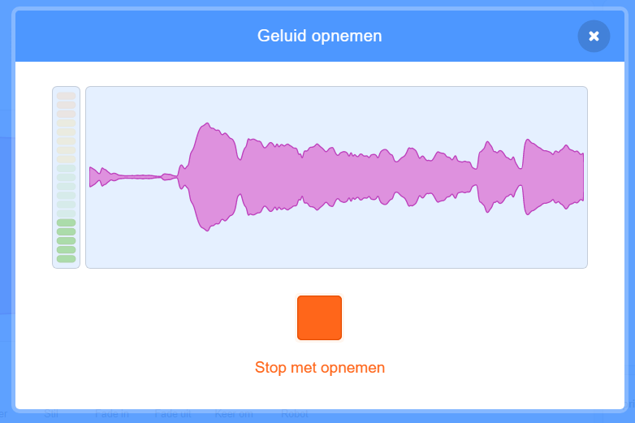

Selecteer de sprite waarvoor je een nieuw geluid wilt opnemen, en klik dan op het **Geluiden** tabblad:

Ga naar het **Kies een geluid** menu en kies **Opnemen**:

Als je zover bent, klik je op de **Opnemen** knop om je geluid op te nemen:

Klik op de **Stop met opnemen** knop om je geluidsopname te beëindigen:

Je nieuwe opname is nu zichtbaar. Je kunt je geluid **Opnieuw opnemen** als je er niet tevreden over bent.

Versleep de oranje cirkels om je geluid in te korten; het deel van het geluid met de blauwe achtergrond (tussen de oranje cirkels) is het gedeelte dat bewaard wordt:

Als je tevreden bent met je opname, klik je op de **Bewaar** knop. Je komt meteen terug in het **Geluiden** tabblad en je ziet het geluid dat je hebt opgenomen.

Als je naar het **Code** tabblad gaat en kijkt naar de `Geluid`{:class="block3sound"} blokken, kun je je nieuwe geluid gebruiken:

