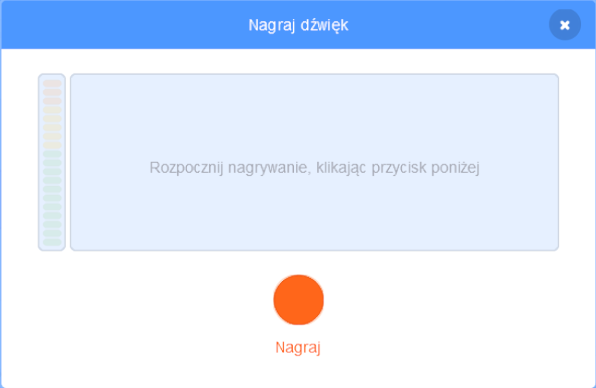

Wybierz duszka, dla którego chcesz mieć nowo nagrany dźwięk, a następnie wybierz zakładkę **Dźwięki**:

Przejdź do menu **Wybierz dźwięk** i wybierz opcję **Nagraj**:

Gdy będziesz gotowy, kliknij przycisk **Nagraj**, aby rozpocząć nagrywanie dźwięku:

Kliknij przycisk **Zatrzymaj nagrywanie**, aby zatrzymać nagrywanie dźwięku:

Twoje nowe nagranie zostanie pokazane. Możesz wybrać **Nagraj ponownie** swój dźwięk, jeśli nie jesteś z niego zadowolony.

Przeciągnij pomarańczowe kółka, aby przyciąć dźwięk; część dźwięku z niebieskim tłem (między pomarańczowymi kółkami) będzie częścią, która zostanie zachowana:

Gdy jesteś zadowolony ze swojego nagrania, kliknij przycisk **Zapisz**. Zostaniesz przeniesiony z powrotem do zakładki **Dźwięki** i będziesz mógł zobaczyć właśnie dodany dźwięk:

Jeśli przejdziesz do **Skrypt** i spojrzysz na `Dźwięk`{:class="block3sound"}, będziesz mógł wybrać nowy dźwięk:

