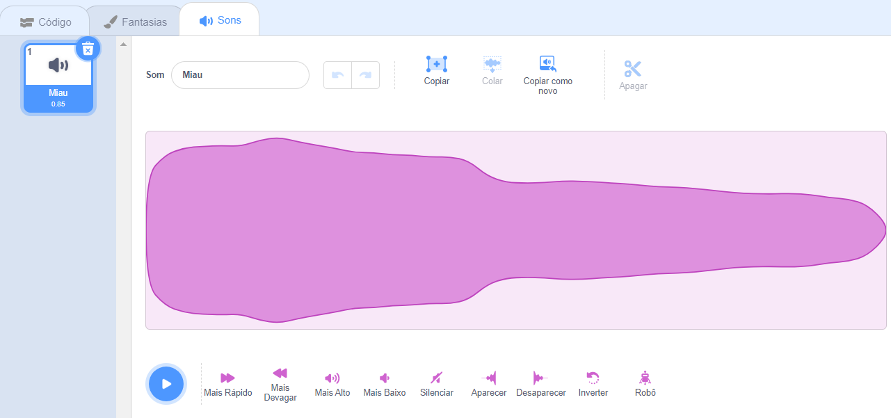

Selecione o ator que você deseja para ter o novo som gravado, em seguida, selecione a aba **Sons**:

Vá para o menu **Escolha um som** e selecione a opção **Gravar**:

Quando você estiver pronto, clique no botão **Gravar** para iniciar a gravação do seu som:

Clique no botão **Parar gravação** para parar de gravar um som:

Sua nova gravação será exibida. Você pode **Regravar** seu som se você não estiver satisfeito com ele.

Arraste os círculos laranja para cortar seu som; a parte do som com fundo azul (entre os círculos laranja) será mantida a parte:

Quando estiver satisfeito com sua gravação, clique no botão **Salvar**. Você será levado de volta à aba **Sons** e poderá ver que o som foi adicionado:

Se você alterar para a aba **Código** e olhar o menu de blocos `Som`{:class="block3sound"}, poderá selecionar o novo som:

