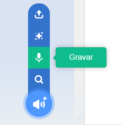

Selecione o ator que você deseja para ter o novo som gravado, em seguida, selecione a aba **Sons**:

Vá para o menu **Escolha um som** e selecione a opção **Gravar**:

Quando você estiver pronto, clique no botão **Gravar** para iniciar a gravação do seu som:

Clique no botão **Parar gravação** para parar de gravar um som:

Sua nova gravação será exibida. Você pode **Regravar** seu som se você não estiver satisfeito com ele.

Arraste os círculos laranja para cortar seu som; a parte do som com fundo azul (entre os círculos laranja) será mantida a parte:

Quando estiver satisfeito com sua gravação, clique no botão **Salvar**. You will be taken straight back to the **Sounds** tab and you will be able to see the sound that you have just added:

If you switch to the **Code** tab and look at the `Sound`{:class="block3sound"} blocks menu, you will be able to select the new sound:

