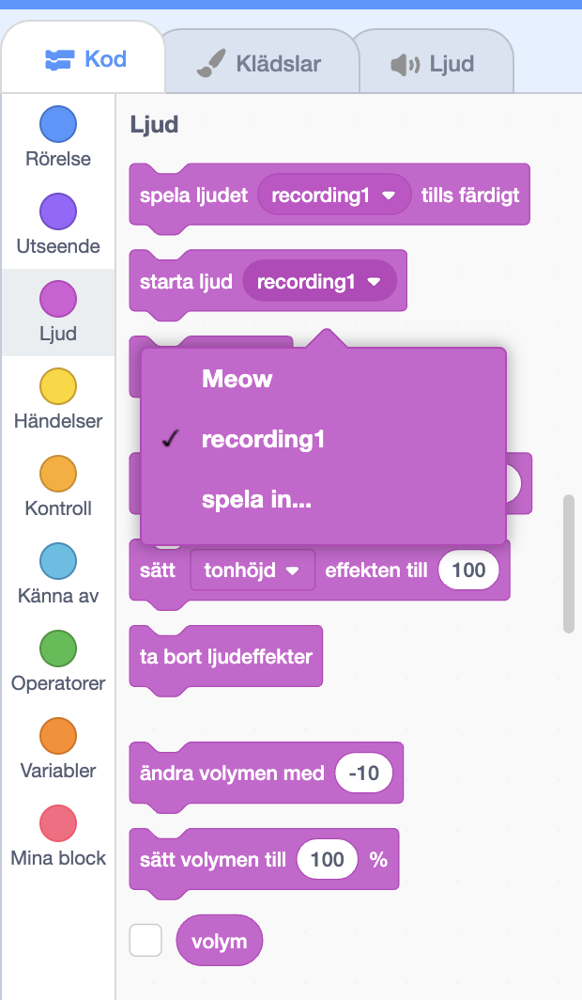

Välj sprajten som du vill ska ha det inspelade ljudet och välj sedan **Ljud**fliken:

Gå till **"Välj ett ljud"**-menyn och välj alternativet **"Spela in"**:

När du är redo, klicka på **"Spela in"**-knappen för att börja spela in ditt ljud:

Klicka på **"Sluta spela in"**-knappen för att sluta spela in ditt ljud:

Din nya inspelning kommer att visas. Du kan **spela** in ditt ljud igen om du inte är nöjd med det.

Dra de orange cirklarna för att klippa ditt ljud; delen av ljudet med blå bakgrund (mellan de orange cirklarna) kommer att vara den del som behålls:

När du är nöjd med din inspelning, klicka på **Spara**knappen. Du kommer direkt tillbaka till **Ljud**fliken och kommer kunna se ljudet som du precis har lagt till:

Om du byter till **Kod**-fliken och tittar på menyn `Ljud`{:class="block3sound"}block, kommer du att kunna välja det nya ljudet:

