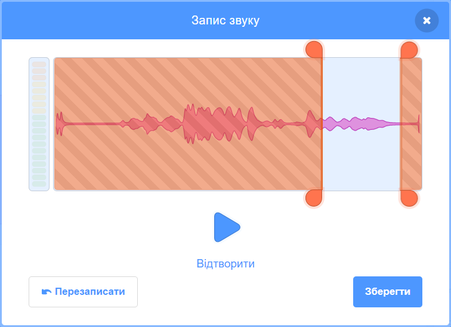

Вибери спрайт, для якого ти хочеш записати новий звук, і перейди на вкладку **Звуки**:

Перейди до меню **Обрати звук** та вибери опцію **Записати**:

Коли ти будеш напоготові, натисни кнопку **Записати**, щоб почати запис звуку:

Натисни кнопку **Зупинити запис**, щоб зупинити запис звуку:

З'явиться твій новий запис. Ти можеш **Перезаписати** твій звук, якщо він тебе не влаштовує.

Перетягуй оранжеві кружечки, щоб обрізати звук; частина звуку з синім фоном (між оранжевими кружечками) буде збережена окремою частиною:

Якщо тебе влаштовує твій запис, натисни кнопку **Зберегти**. Ти повернешся на вкладку **Звуки** та зможеш побачити звук, який щойно був створений:

Якщо ти перейдеш на вкладку **Код** і подивишся на меню блоків `Звук`{:class="block3sound"}, ти зможеш вибрати новий звук:

